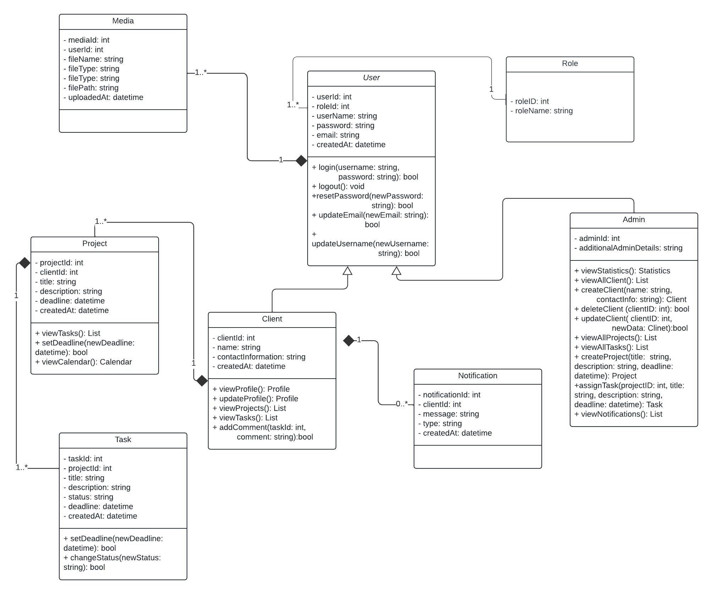

# Inertia CRM

Inertia CRM is a customer relationship management (CRM) system built using Laravel and React. This repository serves as a starting point for developing a CRM application to manage clients, projects, tasks, and communications. The project includes a pre-defined database schema and initial setup for backend and frontend integration using Inertia.js. Whether you're an admin handling client accounts or a client tracking project progress, Inertia CRM provides a straightforward platform to streamline your workflow and improve organization.

## UML Class Diagram:

